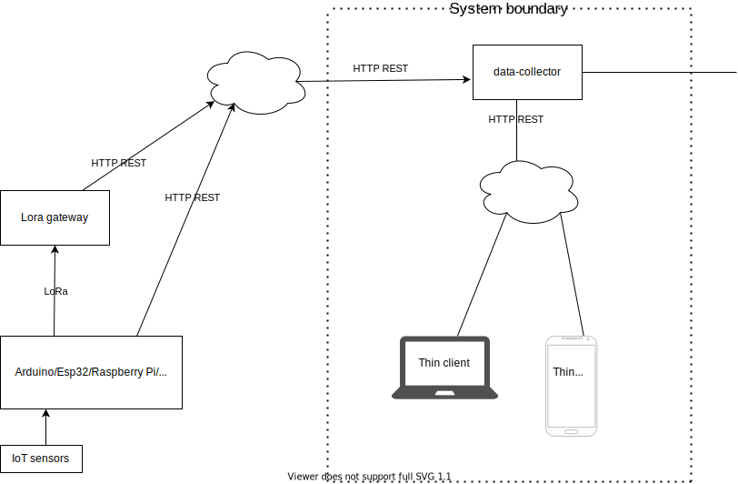
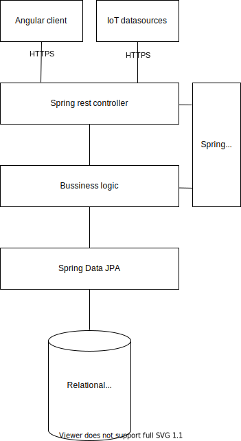
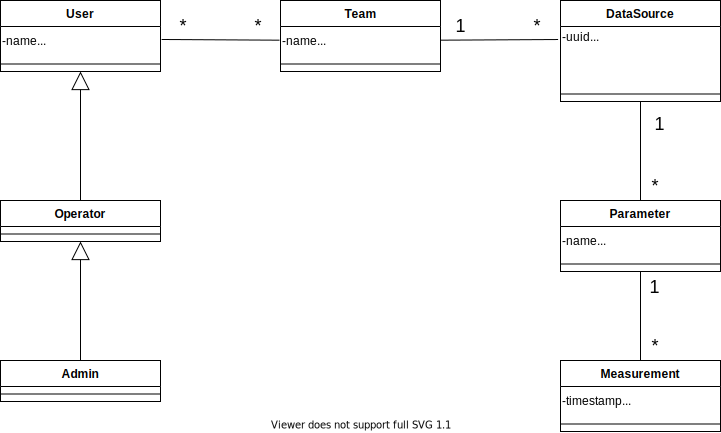

# Adatrögzítő és -lekérdező alkalmazás fejlesztése Spring és Angular platformon

## A data-collector alkalmazás áttekintése

Az alkalmazás hálózaton keresztül érkező (IoT) adatokat rögzít adatbázisba, felhasználók által definiált szigorú struktúra szerint.  
A rendszer többfelhasználós, minden felhasználónak csak a saját adataihoz van hozzáférése, ezeket jogosultsági szintjének megfelelően szerkesztheti.  
 A szolgáltatások interfésze HTTP REST API, a kliens Angular alkalmazás. Minden kommunikáció TLS felett történik.  
 
 
 
 ## Architektúra

A **data-collector** egy Spring Boot-os, Spring MVC alkalmazás, Angular megjelenítéssel. Az autentikáció/autorizáció Spring Security-vel történik. Az objektum-relációs leképezésért a Spring Data JPA felel.

 

## Entitások

 
 
## Funkcionális specifikáció

### Az adatok elmentése

Az alkalmazás adatcsomagokat kap REST API-n, ezek kötelezően tartalmaznak egy **uuid** nevű mezőt, ez alapján kerül azonosításra egy **DataSource** példány, amelynek **Parameter** tagváltozói megfeleltethetőek az adatcsomagban érkezett kulcs-érték párok kulcsaival. Ha léteznek az adatbázisban az előbb említett entitások, akkor az aktuális idő felhasználásával új **Measurement** kerül bejegyzésre.  
Az adatok mentésénél autentikáció/autorizáció kizárólag a titkos **uuid** mező alapján történik.

### Adatszerkezet definiálása

Az Angular alkalmazásban, a felhasználók bejelentkezhetnek felhasználónév + jelszó megadásával. Kilistázhatják a saját magukkal kapcsolatban álló entitásokat, ha jogosultsági szintjük engedi, HTML form -ok segítéségével szerkeszthetik is azokat.  
A legalacsonyabb jogolsultsági szint a **User**, csak olvasni tudja az adatokat. Az **Operator** létrehozhat, módosíthat, törölhet **DataSource**-okat, **Parameter**-eket. Az **Admin** felhasználóknak korlátlan jogosultságai vannak az objektumok felett.  


### Minta IoT Adatcsomagok

```json
{
  "uuid": "b525b1b7-1a16-4d01-96aa-6ee6a2814167",
  "payload": {
    "moisture_A_5cm": 13.55,
    "temperature_A_5cm": 14.39,
    "dielectric_A_5cm": 8.4,
    "pump_state": 1.0
  }
}
```

```json
{
  "uuid": "0d5d96d4-d630-4788-b9df-048d04317c40",
  "payload": {
    "absolute_air_pressure": 944.5,
    "air_temperature": 3.6,
    "position_latitude": 47.69,
    "position_longitude": 18.91,
    "supply_voltage": 12.4
  }
}
```